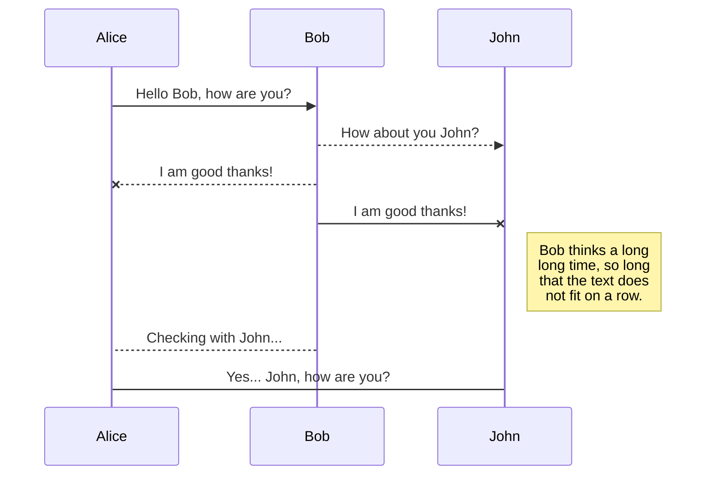

This section provides examples of all style elements available to documentation authors and the guidelines on using them.


<iframe
  className="w-full aspect-video rounded-xl"
  src="https://www.youtube.com/embed/4KzFe50RQkQ"
  title="YouTube video player"
  allow="accelerometer; autoplay; clipboard-write; encrypted-media; gyroscope; picture-in-picture"
  allowFullScreen
></iframe>


## Mermaid Diagrams

Input:

````mdx Mermaid diagram example theme={null}

````

Result:


See more examples [here](https://mermaid.js.org/syntax/examples.html).


